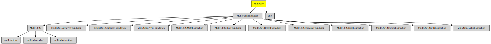

# MulleZlib

#### 🐘 Zlib compression for mulle-objc

Compression and decompression of NSData.


| Release Version                                       | Release Notes  | AI Documentation
|-------------------------------------------------------|----------------|---------------
|  [](//github.com/MulleWeb/MulleZlib/actions) | [RELEASENOTES](RELEASENOTES.md) | [DeepWiki for MulleZlib](https://deepwiki.com/MulleWeb/MulleZlib)


## Example

Compress and decompress a string:

``` objc
NSData     *data;
NSData     *compressed;
NSData     *decompressed;
NSString   *s;

data         = [@"VfL Bochum 1848" dataUsingEncoding:NSUTF8StringEncoding];
compressed   = [data mulleZlibCompressedData];
decompressed = [compressed mulleZlibDecompressedData];
s            = [NSString mulleStringWithData:decompressed
                                    encoding:NSUTF8StringEncoding];
```


## API

Adds the following compression and decompressions methods to **NSData**:

``` objc
- (NSData *) mulleZlibCompressedDataWithCompressionLevel:(int) level;
- (NSData *) mulleZlibCompressedData;
- (NSData *) mulleZlibDecompressedData;
```


### You are here




## Add

Use [mulle-sde](//github.com/mulle-sde) to add MulleZlib to your project:

``` sh
mulle-sde add github:MulleWeb/MulleZlib
```

## Install

### Install with mulle-sde

Use [mulle-sde](//github.com/mulle-sde) to build and install MulleZlib and all dependencies:

``` sh
mulle-sde install --prefix /usr/local \
   https://github.com//MulleZlib/archive/latest.tar.gz
```

### Manual Installation

Install the requirements:

| Requirements                                 | Description
|----------------------------------------------|-----------------------
| [zlib](https://github.com/madler/zlib)             | 
| [MulleFoundationBase](https://github.com/MulleFoundation/MulleFoundationBase)             | 🧱 MulleFoundationBase amalgamates Foundations projects
| [mulle-objc-list](https://github.com/mulle-objc/mulle-objc-list)             | 📒 Lists mulle-objc runtime information contained in executables.

Download the latest [tar](https://github.com/MulleWeb/MulleZlib/archive/refs/tags/latest.tar.gz) or [zip](https://github.com/MulleWeb/MulleZlib/archive/refs/tags/latest.zip) archive and unpack it.

Install **MulleZlib** into `/usr/local` with [cmake](https://cmake.org):

``` sh
cmake -B build \
      -DCMAKE_INSTALL_PREFIX=/usr/local \
      -DCMAKE_PREFIX_PATH=/usr/local \
      -DCMAKE_BUILD_TYPE=Release &&
cmake --build build --config Release &&
cmake --install build --config Release
```

### Platforms and Compilers

All platforms and compilers supported by
[mulle-c11](//github.com/mulle-c/mulle-c11).


## Author

[Nat!](https://mulle-kybernetik.com/weblog) for Mulle kybernetiK  

